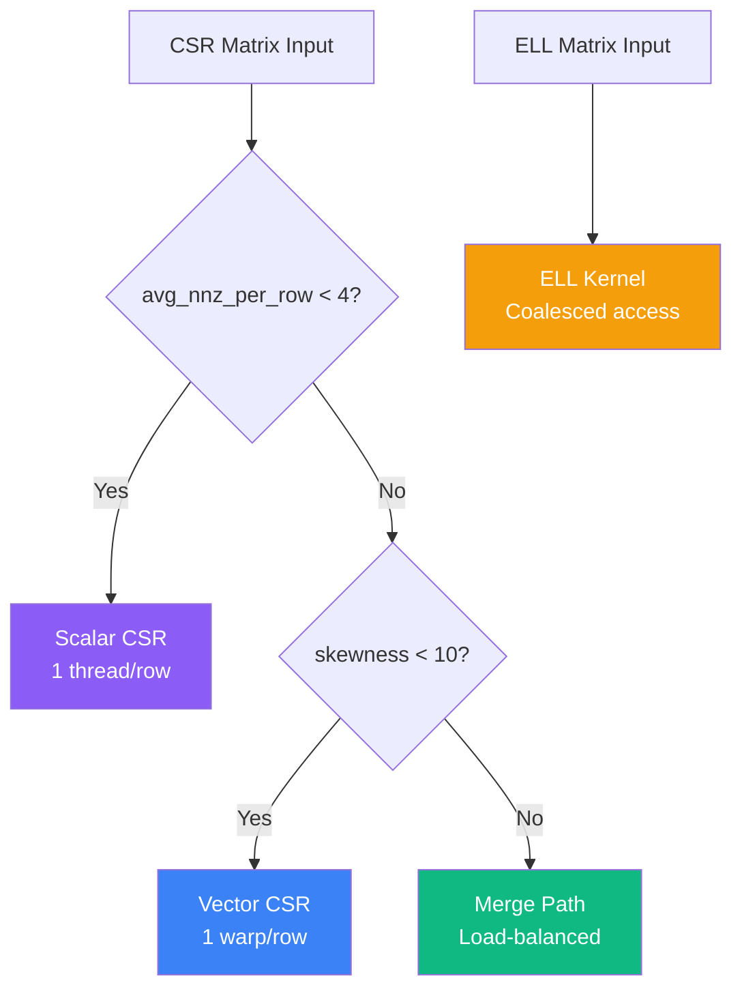

# Kernel Selection Strategy

Automatic kernel selection based on matrix characteristics.

## Selection Flow



## Kernel Comparison

| Kernel | Thread Strategy | Best For | Bandwidth | Complexity |
|:-------|:----------------|:---------|:---------:|:----------:|
| Scalar CSR | 1 thread/row | Very sparse (nnz/row < 4) | ~40-50% | ★☆☆☆☆ |
| Vector CSR | 1 warp/row | Uniform distribution | ~65-75% | ★★☆☆☆ |
| Merge Path | Dynamic partitioning | Highly skewed matrices | ~70-80% | ★★★★★ |
| ELL Kernel | Column parallel | Uniform row lengths | ~80-90% | ★★★☆☆ |

## Selection Thresholds

Default thresholds for automatic selection:

| Threshold | Default | Purpose |
|:----------|:-------:|:--------|
| `avg_nnz_threshold` | 4.0 | Determines if Scalar CSR should be used |
| `skewness_threshold` | 10.0 | Determines if Merge Path should be used |
| `texture_cols_threshold` | 10000 | Enables texture cache for large vectors |

### Custom Thresholds

```cpp
SpMVThresholds thresholds = {
    .avg_nnz_threshold = 4.0f,
    .skewness_threshold = 10.0f,
    .texture_cols_threshold = 10000
};
spmv_set_thresholds(thresholds);
```

## Matrix Statistics

Key metrics used for kernel selection:

### avg_nnz_per_row

Average non-zero elements per row. Low values indicate very sparse matrices where Scalar CSR excels.

### Skewness

Ratio of max to min non-zeros per row: `max / (min + 1)`

- **< 10**: Uniform distribution → Vector CSR
- **≥ 10**: Skewed distribution → Merge Path

```cpp
CSRStats stats = csr_compute_stats(csr);
printf("Skewness: %.2f\n", stats.skewness);
```

## Performance Tips

1. **Very sparse matrices** (avg_nnz < 4): Let Scalar CSR handle it
2. **Uniform matrices**: Vector CSR provides good balance
3. **Skewed matrices**: Merge Path ensures load balancing
4. **Uniform row lengths**: Convert to ELL for best performance

## Manual Override

You can override automatic selection:

```cpp
// Force specific kernel
SpMVConfig config;
config.kernel_type = KernelType::MERGE_PATH;
config.block_size = 256;
config.use_texture = true;

SpMVResult result = spmv_csr(csr, d_x, d_y, &config);
```

## References

- [Bell & Garland (2009)](/en/references) — CSR vs ELL analysis
- [Merrill & Garland (2016)](/en/references) — Merge Path algorithm
