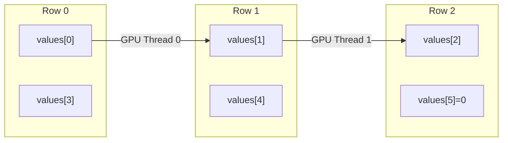

# Memory Layout

Detailed memory layout of CSR and ELL sparse matrix formats.

## CSR (Compressed Sparse Row)

### Storage Structure

```
Original Matrix:     CSR Storage:
┌─────┬─────┐        values:     [ 1, 2, 3, 4, 5 ]
│ 1 0 2 │        col_indices: [ 0, 2, 1, 2, 3 ]
│ 0 3 4 │   =>   row_ptrs:    [ 0, 2, 4, 5 ]
│ 0 0 5 │       
└─────┴─────┘        row_ptrs[i] indicates the starting position of row i
```

**Storage Cost**: `O(nnz + num_rows)`

### Array Description

| Array | Size | Description |
|:------|:-----|:------------|
| `values` | nnz | Non-zero values, row-major order |
| `col_indices` | nnz | Column index for each non-zero |
| `row_ptrs` | num_rows + 1 | Starting offset for each row |

### Access Pattern

```
Non-zeros in row i:
  values[row_ptrs[i]] ... values[row_ptrs[i+1] - 1]
  col_indices[row_ptrs[i]] ... col_indices[row_ptrs[i+1] - 1]
```

### Characteristics

- General format, memory efficient
- Suitable for irregular sparsity patterns
- Efficient row traversal
- May cause non-coalesced GPU memory access

## ELL (ELLPACK)

### Storage Structure

```
Original Matrix:     ELL Storage (column-major):
┌─────┬─────┐        values:     [ 1, 3, 5,   ← column 0
│ 1 0 2 │                      2, 4, 0 ]  ← column 1
│ 0 3 4 │   =>   col_indices: [ 0, 1, 3,   ← column 0
│ 0 0 5 │                      2, 2, - ]  ← column 1 (-1 = padding)
└─────┴─────┘        
                     Each row padded to max length
```

**Storage Cost**: `O(num_rows × max_nnz_per_row)`

### Column-Major Storage



### Characteristics

- **Column-major storage**: GPU threads access consecutive memory, fully coalesced
- **No row pointers**: Reduces one memory access
- **Aligned padding**: Suitable for SIMD execution
- **Drawback**: Wastes storage when row lengths vary significantly

## CSR vs ELL Selection

| Factor | CSR | ELL |
|:-------|:----|:----|
| Storage efficiency | High (only non-zeros) | Low (padding needed) |
| GPU memory access | May be non-coalesced | Fully coalesced |
| Best for | Irregular sparsity | Uniform row lengths |
| Conversion cost | — | O(nnz) |

## References

- [Architecture Overview](/en/architecture/overview)
- [Kernel Selection](/en/architecture/kernel-selection)
