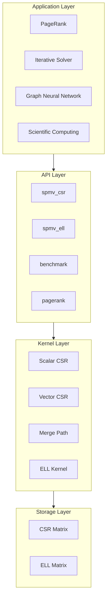

# Architecture Overview

The architectural story of GPU SpMV is not just “what modules exist,” but **how matrix statistics, kernel choice, execution context, and validation fit together into an explainable engineering system**.

## System Architecture

## Design Principles

| Principle | Implementation | Benefit |
|:----------|:---------------|:--------|
| Layered Architecture | Storage, compute, application separation | Separation of concerns, easy maintenance |
| Strategy Pattern | Pluggable kernel selection | Flexible algorithm extension |
| RAII Management | CudaBuffer auto-release | Prevent memory leaks |
| Semantic Errors | SpMVError enum | Clear diagnostic information |

## Four Layers

### Storage Layer

Defines memory layout of sparse matrices:

- **CSR Matrix** — General format, memory efficient
- **ELL Matrix** — Column-major storage, GPU optimized

### Kernel Layer

Implements four optimized SpMV kernels:

| Kernel | Thread Strategy | Best For | Bandwidth |
|:-------|:----------------|:---------|:---------:|
| Scalar CSR | 1 thread/row | Very sparse (nnz/row < 4) | ~40-50% |
| Vector CSR | 1 warp/row | Uniform distribution | ~65-75% |
| Merge Path | Dynamic partitioning | Highly skewed | ~70-80% |
| ELL Kernel | Column parallel | Uniform row lengths | ~80-90% |

### API Layer

Provides user-friendly interfaces:

- `spmv_csr()` — CSR format SpMV
- `spmv_ell()` — ELL format SpMV
- `spmv_auto_config()` — Automatic kernel selection
- `pagerank()` — PageRank algorithm

### Application Layer

Applications built on SpMV:

- **PageRank** — Web page ranking
- **Iterative Solvers** — CG, GMRES, etc.
- **Graph Neural Networks** — Sparse graph convolution
- **Scientific Computing** — FEM, CFD

## The three most important ideas on this page

1. **How data flows** from sparse input to validated output.
2. **Why automatic selection is justified** by `avg_nnz_per_row` and skewness rather than opaque tuning.
3. **Why the system is trustworthy** thanks to resource management, semantic errors, CPU reference paths, and property tests.

## Related Documentation

- [Kernel Selection](/en/architecture/kernel-selection)
- [Execution Pipeline](/en/architecture/execution-pipeline)
- [Memory Layout](/en/architecture/memory-layout)
- [Reliability Constraints](/en/architecture/reliability)
- [Spec-Driven Development](/en/architecture/spec-driven)
