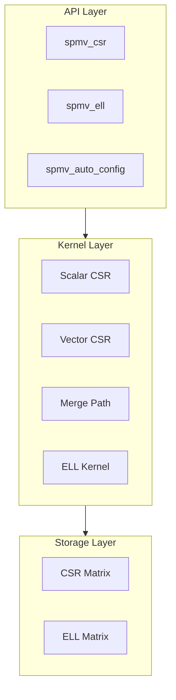

# Architecture Overview

GPU SpMV now keeps the architecture deliberately small: sparse storage, kernel execution, and a narrow public API.

## System Architecture

## Design Principles

| Principle | Implementation | Benefit |
|:----------|:---------------|:--------|
| Layered Architecture | Storage and compute remain separated | Easier maintenance |
| Strategy Selection | Kernel choice based on matrix statistics | Predictable execution |
| RAII Management | `CudaBuffer<T>` and execution contexts | Safer resource lifetime |
| Semantic Errors | `SpMVError` and explicit return values | Clear diagnostics |

## Core Layers

### Storage Layer

- **CSR Matrix** — general-purpose sparse format
- **ELL Matrix** — column-major layout for regular sparsity

### Kernel Layer

| Kernel | Thread Strategy | Best For | Bandwidth |
|:-------|:----------------|:---------|:---------:|
| Scalar CSR | 1 thread/row | Very sparse (nnz/row < 4) | ~40-50% |
| Vector CSR | 1 warp/row | Uniform distribution | ~65-75% |
| Merge Path | Dynamic partitioning | Highly skewed | ~70-80% |
| ELL Kernel | Column parallel | Uniform row lengths | ~80-90% |

### API Layer

- `spmv_csr()` — CSR format execution
- `spmv_ell()` — ELL format execution
- `spmv_auto_config()` — kernel auto-selection

## The three most important ideas on this page

1. **Data flows** from sparse storage to a chosen kernel and then to validated output.
2. **Kernel selection is explicit**, driven by `avg_nnz_per_row` and skewness.
3. **Reliability is engineered**, not implied, through RAII, semantic errors, and focused tests.

## Related Documentation

- [Kernel Selection](/en/architecture/kernel-selection)
- [Execution Pipeline](/en/architecture/execution-pipeline)
- [Memory Layout](/en/architecture/memory-layout)
- [Reliability Constraints](/en/architecture/reliability)
