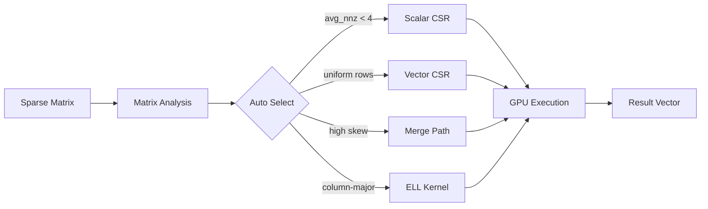

  

    
GPU

    

      GPU SpMV
      Technical Whitepaper
    

  

  

    <a href="./whitepaper/">Whitepaper</a>
    <a href="https://github.com/LessUp/gpu-spmv">GitHub</a>
    <a href="../zh/">中文</a>
  

  <h1>Production-Grade CUDA Sparse Matrix-Vector Multiplication</h1>
  

    High-performance SpMV achieving <strong>70%+ theoretical memory bandwidth</strong> on modern NVIDIA GPUs.
    4 adaptive kernels, intelligent selection algorithm, comprehensive API.
  

  

    <a href="./whitepaper/" class="primary">Read the Whitepaper</a>
    <a href="./quickstart" class="secondary">Quick Start</a>
  

  

    
70%+

    
Bandwidth Utilization

  

  

    
4

    
Adaptive Kernels

  

  

    
CSR+ELL

    
Sparse Formats

  

  

    
100+

    
Test Cases

  

## Architecture Overview

## Technical Features

  

    
Kernel Selection Strategy

    

      Automatic kernel selection based on matrix characteristics: avg_nnz, row length skewness.
    

    

      <a href="./architecture/kernel-selection" class="feature-tag">Details</a>
    

  

  

    
Merge Path Algorithm

    

      Perfect load balancing for irregular sparsity patterns. O(nnz + m) work decomposition.
    

    

      <a href="./whitepaper/philosophy" class="feature-tag">Philosophy</a>
    

  

  

    
Production Quality

    

      RAII resource management, semantic error codes, CudaBuffer abstraction, cross-platform.
    

    

      <a href="./api/spmv" class="feature-tag">API</a>
    

  

  

    
Spec-Driven Development

    

      OpenSpec specification-driven workflow. Design decisions traceable, documentation as code.
    

    

      <a href="./architecture/spec-driven" class="feature-tag">Workflow</a>
    

  

  

    
Academic Rigor

    

      Complete academic citation support, BibTeX format, related paper references.
    

    

      <a href="./citation" class="feature-tag">Citation</a>
    

  

  

    
Quick Start

    

      <code>git clone https://github.com/LessUp/gpu-spmv.git</code>
    

    

      <a href="./quickstart" class="feature-tag">Guide</a>
    

  

