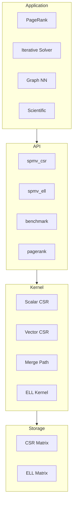

<div class="sp-home-extra">

## Code Preview

<div class="sp-code-window">
  <div class="sp-code-header">
    <span class="sp-dot sp-dot-red"></span>
    <span class="sp-dot sp-dot-yellow"></span>
    <span class="sp-dot sp-dot-green"></span>
    <span class="sp-code-title">example.cpp</span>
  </div>

```cpp
#include <spmv/spmv.h>

int main() {
    // Create sparse matrix
    CSRMatrix* csr = csr_create(10000, 10000, 500000);
    csr_from_dense(csr, data, 10000, 10000);
    csr_to_gpu(csr);

    // Auto-select optimal kernel and execute
    SpMVConfig config = spmv_auto_config(csr);
    SpMVResult result = spmv_csr(csr, d_x, d_y, &config, n);

    // 70%+ bandwidth utilization
    printf("Bandwidth: %.1f%%\n",
           result.bandwidth_utilization * 100);
}
```
</div>

## Performance

| Matrix Size | Non-zeros | Kernel | Bandwidth |
|:-----------:|:---------:|:-------|:---------:|
| 10K × 10K | 500K | Vector CSR | **70.2%** |
| 100K × 100K | 5M | Merge Path | **71.5%** |
| 1M × 1M | 50M | Merge Path | **70.8%** |

<p class="sp-perf-note">Benchmarks: NVIDIA RTX 3090 (Ampere, 936 GB/s)</p>

## Architecture



## Use Cases

- 🕸️ **Graph Algorithms** — PageRank, shortest path, community detection
- 🔬 **Scientific Computing** — Finite element analysis, CFD
- 🤖 **Machine Learning** — Sparse neural networks, recommendations
- 📊 **Data Analytics** — Matrix factorization, eigenvalue computation

</div>

<style>
.sp-home-extra {
  max-width: 800px;
  margin: 0 auto;
  padding: 0 var(--spacing-lg);
}

.sp-code-window {
  border-radius: var(--radius-lg);
  overflow: hidden;
  border: 1px solid var(--vp-c-border);
  margin: var(--spacing-lg) 0;
}

.sp-code-header {
  display: flex;
  align-items: center;
  gap: 8px;
  padding: 12px 16px;
  background: var(--vp-code-block-bg);
  border-bottom: 1px solid var(--vp-code-block-border);
}

.sp-dot {
  width: 12px;
  height: 12px;
  border-radius: 50%;
}

.sp-dot-red { background: #FF5F57; }
.sp-dot-yellow { background: #FEBC2E; }
.sp-dot-green { background: #28C840; }

.sp-code-title {
  margin-left: auto;
  font-family: var(--vp-font-family-mono);
  font-size: 12px;
  color: var(--vp-c-text-3);
}

.sp-perf-note {
  text-align: center;
  font-size: 13px;
  color: var(--vp-c-text-3);
}
</style>
