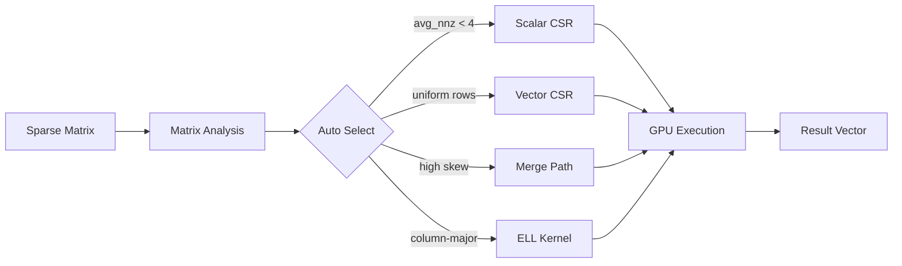

  

    
GPU

    

      GPU SpMV
      Technical Whitepaper
    

  

  

    <a href="./whitepaper/">Whitepaper</a>
    <a href="https://github.com/LessUp/gpu-spmv">GitHub</a>
    <a href="../zh/">中文</a>
  

  <h1>Production-Grade CUDA SpMV</h1>
  

    High-performance sparse matrix-vector multiplication achieving <strong>70%+ theoretical memory bandwidth</strong> on modern NVIDIA GPUs. 4 adaptive kernels, intelligent selection algorithm, comprehensive API.
  

  

    <a href="./whitepaper/" class="primary">Read the Whitepaper</a>
    <a href="./performance/benchmarks" class="secondary">View Benchmarks</a>
  

  

    
70%+

    
Bandwidth Utilization

  

  

    
4

    
Adaptive Kernels

  

  

    
CSR+ELL

    
Sparse Formats

  

  

    
100+

    
Test Cases

  

## Interactive Performance Dashboard

  <PerformanceChart title="Kernel Performance by Matrix Type" />
  <TrendChart title="Performance vs Matrix Size" />

## Architecture Overview

### Kernel Selection Explorer

<KernelSelector />

## Competitive Positioning

<ComparisonTable lang="en" />

## Technical Features

  

    
Kernel Selection Strategy

    

      Automatic kernel selection based on matrix characteristics: avg_nnz, row length skewness, and distribution pattern.
    

    

      <a href="./architecture/kernel-selection" class="feature-tag">Details</a>
      <a href="./whitepaper/performance" class="feature-tag">Analysis</a>
    

  

  

    
Memory Layout Optimization

    

      ELL column-major layout for fully coalesced memory access. CSR row-major for general sparse patterns.
    

    

      <a href="./architecture/memory-layout" class="feature-tag">Memory</a>
      <a href="./api/ell-matrix" class="feature-tag">ELL API</a>
    

  

  

    
Merge Path Algorithm

    

      Perfect load balancing for irregular sparsity patterns. O(nnz + m) work decomposition across thread blocks.
    

    

      <a href="./whitepaper/philosophy" class="feature-tag">Philosophy</a>
      <a href="./architecture/overview" class="feature-tag">Architecture</a>
    

  

  

    
Production Quality

    

      RAII resource management, semantic error codes (SpMVError), CudaBuffer abstraction, cross-platform support.
    

    

      <a href="./api/spmv" class="feature-tag">API</a>
      <a href="./architecture/overview" class="feature-tag">Design</a>
    

  

  

    
Spec-Driven Development

    

      OpenSpec specification-driven workflow. Design decisions are traceable, changes are managed, documentation is code.
    

    

      <a href="./architecture/spec-driven" class="feature-tag">Workflow</a>
    

  

  

    
Academic Rigor

    

      Complete academic citation support, BibTeX format, related paper references, reproducible benchmarks.
    

    

      <a href="./references" class="feature-tag">References</a>
      <a href="./citation" class="feature-tag">Citation</a>
    

  

## Quick Start

  
Build from Source

  

    

      <code>git clone https://github.com/LessUp/gpu-spmv.git</code>
    

    

      <code>cmake -S . -B build && cmake --build build</code>
    

    See the <a href="./quickstart">Quick Start Guide</a> for more details.
  

