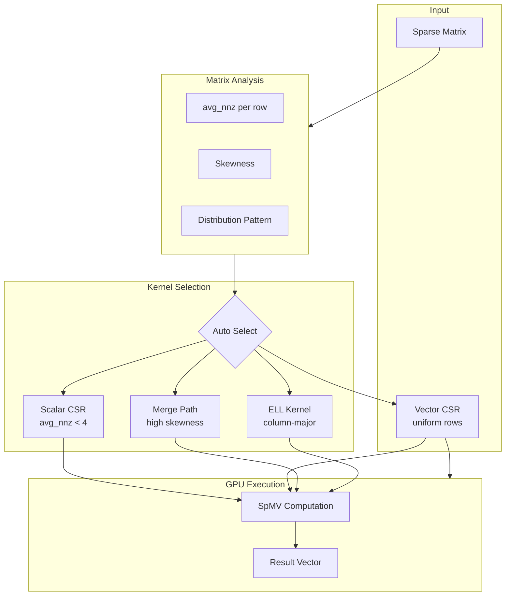

# Technical Whitepaper

## Executive Summary

GPU SpMV is a **production-grade CUDA library** implementing high-performance sparse matrix-vector multiplication (SpMV), achieving **70%+ of theoretical memory bandwidth** on modern NVIDIA GPUs.

### Key Contributions

| Contribution | Impact |
|:-------------|:-------|
| **4 Optimized Kernels** | Adaptive kernel selection based on matrix characteristics |
| **Merge Path Algorithm** | Perfect load balancing for irregular sparsity patterns |
| **ELL Column-Major Layout** | Fully coalesced memory access for uniform matrices |
| **Spec-Driven Development** | Complete design decision traceability |

### Performance Highlights

| Matrix Size | Non-zeros | Kernel | Bandwidth Utilization |
|:-----------:|:---------:|:-------|:---------------------:|
| 10K × 10K | 500K | Vector CSR | **70.2%** |
| 100K × 100K | 5M | Merge Path | **71.5%** |
| 1M × 1M | 50M | Merge Path | **70.8%** |

::: info Benchmark Environment
NVIDIA RTX 3090 (Ampere architecture, theoretical bandwidth: 936 GB/s)
:::

### Target Audience

- **Systems Architects**: Designing GPU-accelerated sparse computations
- **HPC Engineers**: Optimizing memory-bound workloads
- **Researchers**: Requiring reproducible, well-documented baselines
- **Application Developers**: Building graph algorithms, iterative solvers

### Document Structure

| Section | Purpose |
|:--------|:--------|
| [Design Philosophy](/en/whitepaper/philosophy) | Architectural principles and trade-offs |
| [Performance Analysis](/en/whitepaper/performance) | Detailed benchmark methodology and results |
| [Architecture Overview](/en/architecture/overview) | System design documentation |
| [API Reference](/en/api/spmv) | Complete API documentation |

---

## Why SpMV Matters

Sparse matrix-vector multiplication (SpMV) is a fundamental operation in:

- **Graph Analytics**: PageRank, community detection, shortest path
- **Scientific Computing**: Finite element analysis, CFD, iterative solvers
- **Machine Learning**: Sparse neural networks, recommendation systems

SpMV is inherently **memory-bound** — each non-zero element requires reading matrix data, column indices, and vector values, with minimal computation. Achieving high bandwidth utilization is the primary optimization challenge.

---

## Design Overview

The library automatically selects the optimal kernel based on matrix characteristics, ensuring near-peak performance across diverse sparsity patterns.