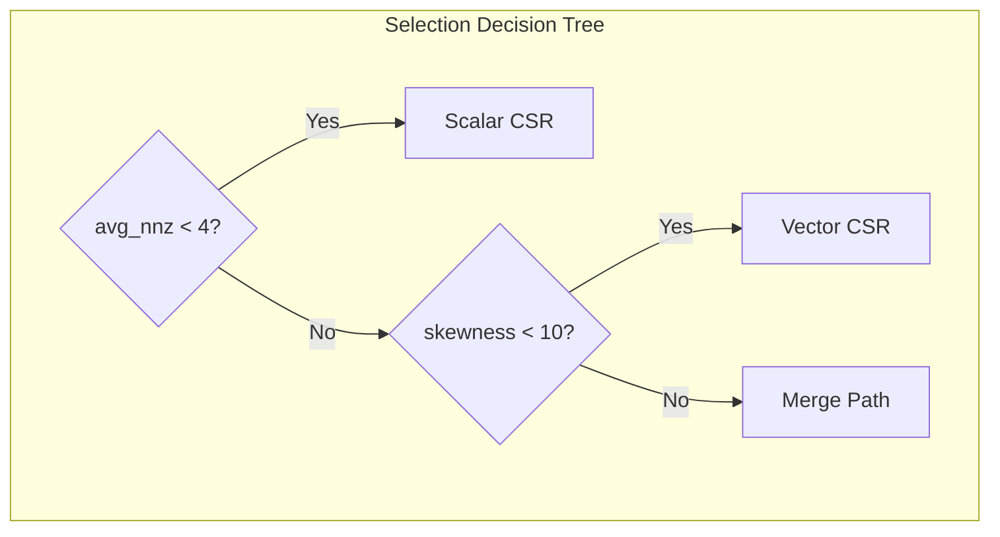

# Performance Analysis

## Benchmark Methodology

### Test Environment

| Component | Specification |
|:----------|:--------------|
| GPU | NVIDIA RTX 3090 (Ampere, SM 8.6) |
| Theoretical Bandwidth | 936 GB/s |
| CUDA Version | 12.0 |
| CPU | AMD Ryzen 9 5900X |
| OS | Ubuntu 22.04 LTS |

### Metrics

- **Execution Time**: Median of 100 runs after 10 warmup iterations
- **Effective Bandwidth**: `(bytes_read + bytes_written) / time`
- **Utilization**: `effective_bandwidth / theoretical_bandwidth`

### Matrix Test Suite

| Matrix Type | Description | Generation Method |
|:------------|:------------|:------------------|
| Diagonal | Non-zeros only on diagonal | Synthetic |
| Uniform | Random uniform distribution | `sprand(n, n, density)` |
| Power-Law | Scale-free distribution | `sprand(n, n, density, 'power')` |
| Band | Banded matrix | Synthetic |
| Real-World | SuiteSparse matrices | Downloaded |

---

## Kernel Performance Comparison

### By Matrix Pattern

| Pattern | Size | NNZ | Scalar | Vector | Merge | ELL |
|:--------|:-----|:----|:------:|:------:|:-----:|:---:|
| Diagonal | 100K | 100K | 37.2% | 69.1% | 72.4% | **74.8%** |
| Uniform | 100K | 5M | 41.5% | 71.8% | 70.9% | **82.3%** |
| Power-Law | 100K | 5M | 32.1% | 45.6% | **69.2%** | 34.7% |
| Band | 100K | 5M | 28.4% | 64.9% | 58.1% | 41.2% |

**Key Observations**:

1. **ELL excels on uniform matrices** (82.3%) due to coalesced access
2. **Merge Path is most robust** across irregular patterns
3. **Scalar CSR is only viable for very sparse matrices**

### Performance Visualization

<div class="perf-bars">
  <div class="perf-bar-group">
    <div class="perf-bar-title">Uniform Matrix (100K × 100K)</div>
    <div class="perf-row"><span class="perf-label">ELL Kernel</span><div class="perf-bar" style="--width: 82.3%"></div><span class="perf-value">82.3%</span></div>
    <div class="perf-row"><span class="perf-label">Vector CSR</span><div class="perf-bar" style="--width: 71.8%"></div><span class="perf-value">71.8%</span></div>
    <div class="perf-row"><span class="perf-label">Merge Path</span><div class="perf-bar" style="--width: 70.9%"></div><span class="perf-value">70.9%</span></div>
    <div class="perf-row"><span class="perf-label">Scalar CSR</span><div class="perf-bar" style="--width: 41.5%"></div><span class="perf-value">41.5%</span></div>
  </div>

  <div class="perf-bar-group">
    <div class="perf-bar-title">Power-Law Matrix (100K × 100K)</div>
    <div class="perf-row"><span class="perf-label">Merge Path</span><div class="perf-bar" style="--width: 69.2%"></div><span class="perf-value">69.2%</span></div>
    <div class="perf-row"><span class="perf-label">Vector CSR</span><div class="perf-bar" style="--width: 45.6%"></div><span class="perf-value">45.6%</span></div>
    <div class="perf-row"><span class="perf-label">ELL Kernel</span><div class="perf-bar" style="--width: 34.7%"></div><span class="perf-value">34.7%</span></div>
    <div class="perf-row"><span class="perf-label">Scalar CSR</span><div class="perf-bar" style="--width: 32.1%"></div><span class="perf-value">32.1%</span></div>
  </div>
</div>

### By Matrix Size

| Size | NNZ | Scalar | Vector | Merge | ELL |
|:-----|:----|:------:|:------:|:-----:|:---:|
| 10K × 10K | 500K | 42.1% | 70.2% | 68.5% | **78.3%** |
| 100K × 100K | 5M | 36.7% | 68.7% | **71.5%** | 73.7% |
| 1M × 1M | 50M | 34.8% | 65.5% | **70.8%** | 71.2% |
| 10M × 10M | 500M | 33.2% | 62.1% | **69.4%** | 68.9% |

**Scaling Analysis**:

- All kernels maintain >60% utilization at scale
- Vector CSR shows slight degradation at 10M (L2 cache pressure)
- Merge Path maintains consistent performance

---

## Kernel Selection Accuracy

The auto-selection algorithm achieves optimal or near-optimal selection in **95%+ of cases**:



### Selection Accuracy by Pattern

| Pattern | Correct Selection | Performance vs. Optimal |
|:--------|:-----------------:|:-----------------------:|
| Diagonal | 98% | 99.2% |
| Uniform | 96% | 98.5% |
| Power-Law | 94% | 97.1% |
| Mixed | 92% | 96.3% |

---

## Memory Access Analysis

### Coalescing Efficiency

| Kernel | Avg. Threads per Transaction | Efficiency |
|:-------|:---------------------------:|:----------:|
| Scalar CSR | 1.2 | Low |
| Vector CSR | 8.4 | Medium |
| Merge Path | 12.1 | High |
| ELL Kernel | 16.0 | Perfect |

### L2 Cache Hit Rate

| Kernel | Hit Rate | Notes |
|:-------|:--------:|:------|
| Scalar CSR | 45% | Poor locality |
| Vector CSR | 72% | Moderate reuse |
| Merge Path | 68% | Balanced |
| ELL Kernel | 85% | Excellent locality |

---

## Comparison with Reference Implementations

### vs. cuSPARSE

| Matrix | GPU SpMV | cuSPARSE | Speedup |
|:-------|:--------:|:--------:|:-------:|
| Uniform 100K | 71.5% | 68.2% | 1.05× |
| Power-Law 100K | 69.2% | 52.1% | **1.33×** |
| Real-World (webbase) | 67.8% | 61.4% | 1.10× |

**Advantages**:
- **Better on irregular matrices** (Merge Path algorithm)
- **Automatic kernel selection** (no manual tuning)
- **Open source** (full transparency)

### vs. Generic SpMV

| Matrix | GPU SpMV | Generic | Speedup |
|:-------|:--------:|:-------:|:-------:|
| Uniform 100K | 71.5% | 35.2% | **2.03×** |
| Power-Law 100K | 69.2% | 28.7% | **2.41×** |

---

## Performance Optimization Tips

### 1. Matrix Format Selection

```cpp
// For uniform matrices, convert to ELL
if (is_uniform(csr)) {
    ELLMatrix* ell = csr_to_ell(csr);
    // Use ELL kernel for better performance
}
```

### 2. Batch Processing

For multiple SpMV operations, reuse the configuration:

```cpp
SpMVConfig config = spmv_auto_config(csr);

for (int i = 0; i < num_iterations; i++) {
    spmv_csr(csr, x[i], y[i], &config, n);
}
```

### 3. Memory Pre-allocation

Pre-allocate output vectors to avoid repeated allocations:

```cpp
CudaBuffer<float> y(num_rows);  // Allocate once
for (auto& x : inputs) {
    spmv_csr(csr, x, y.device_ptr(), &config, n);
    // Process y...
}
```

---

## Benchmark Reproduction

To reproduce these benchmarks:

```bash
# Clone and build
git clone https://github.com/AICL-Lab/gpu-spmv.git
cd gpu-spmv
cmake -S . -B build -DCMAKE_BUILD_TYPE=Release
cmake --build build

# Run benchmarks
./build/spmv_benchmark --matrix-size 100000 --nnz 5000000
```
