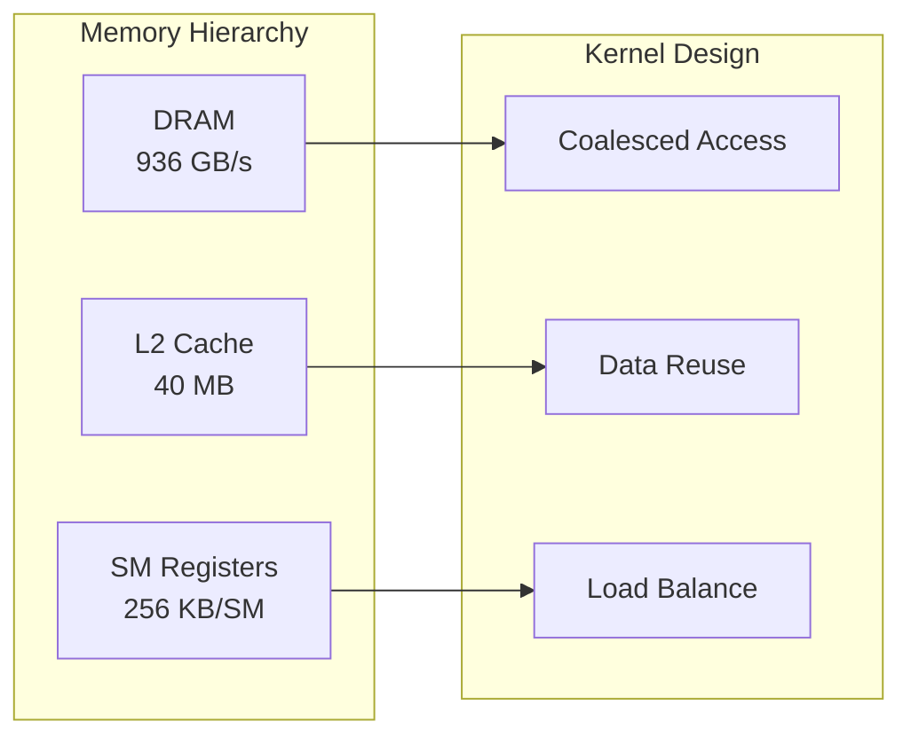
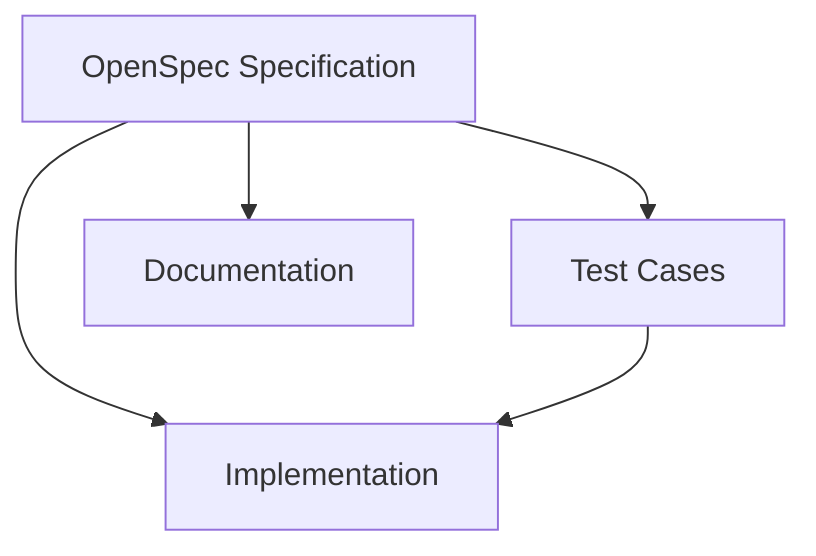
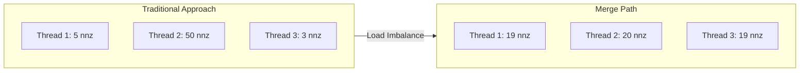

# Design Philosophy

## Core Principles

### 1. Memory-Bandwidth Awareness

SpMV is fundamentally memory-bound. Our design prioritizes:



**Key Insight**: On modern GPUs, memory bandwidth is the bottleneck. Our kernels are designed to maximize memory throughput, not compute throughput.

### 2. Adaptive Computation

No single kernel is optimal for all matrices. Our adaptive selection is based on:

| Matrix Characteristic | Optimal Kernel | Selection Criterion |
|:---------------------|:---------------|:--------------------|
| avg_nnz < 4 | Scalar CSR | Low parallelism per row |
| uniform distribution | Vector CSR | Consistent warp utilization |
| high skewness | Merge Path | Perfect work partitioning |
| ELL-convertible | ELL Kernel | Coalesced memory access |

**Selection Algorithm**:

```cpp
SpMVKernel select_kernel(const CSRMatrix* csr) {
    double avg_nnz = (double)csr->nnz / csr->num_rows;
    
    if (avg_nnz < 4.0) {
        return KERNEL_SCALAR_CSR;  // Low parallelism
    }
    
    double skewness = compute_skewness(csr);
    
    if (skewness < 10.0) {
        return KERNEL_VECTOR_CSR;  // Balanced rows
    }
    
    return KERNEL_MERGE_PATH;      // Irregular patterns
}
```

### 3. Spec-Driven Development

Every feature begins with a specification:



This ensures:
- **Traceability**: Every design decision is documented
- **Correctness**: Tests are derived from specifications
- **Maintainability**: Changes follow a structured process

---

## Kernel Design Trade-offs

### Scalar CSR vs Vector CSR

| Aspect | Scalar CSR | Vector CSR |
|:-------|:-----------|:-----------|
| Parallelism | One thread per row | One warp per row |
| Memory Access | Uncoalesced | Partially coalesced |
| Best For | Very sparse matrices | Uniform sparsity |
| Overhead | Low | Medium |

### Merge Path Algorithm

The Merge Path algorithm provides **perfect load balancing** for irregular matrices:



### ELL Format

For matrices with uniform row lengths, ELL format enables **fully coalesced memory access**:

```
Column-Major Layout:
values[k * num_rows + i] = A[i][col[k]]

Memory Access Pattern:
Thread i reads values[0..num_cols-1] * num_rows + i
→ Consecutive threads access consecutive memory
```

---

## Error Handling Philosophy

We use **semantic error codes** instead of exceptions:

```cpp
typedef enum {
    SPMV_SUCCESS = 0,
    SPMV_ERROR_NULL_POINTER,
    SPMV_ERROR_INVALID_DIMENSIONS,
    SPMV_ERROR_CUDA_MALLOC,
    SPMV_ERROR_CUDA_MEMCPY,
    // ...
} SpMVError;
```

Benefits:
- **Performance**: No exception overhead
- **Interoperability**: C-compatible API
- **Debugging**: Explicit error propagation

---

## RAII Resource Management

All GPU resources are managed via `CudaBuffer<T>`:

```cpp
template<typename T>
class CudaBuffer {
public:
    CudaBuffer(size_t size);
    ~CudaBuffer();  // Automatic cudaFree
    
    T* device_ptr();
    void copy_from_host(const T* src);
    void copy_to_host(T* dst);
    
private:
    T* d_ptr_;
    size_t size_;
};
```

This ensures **no memory leaks** even in error paths.