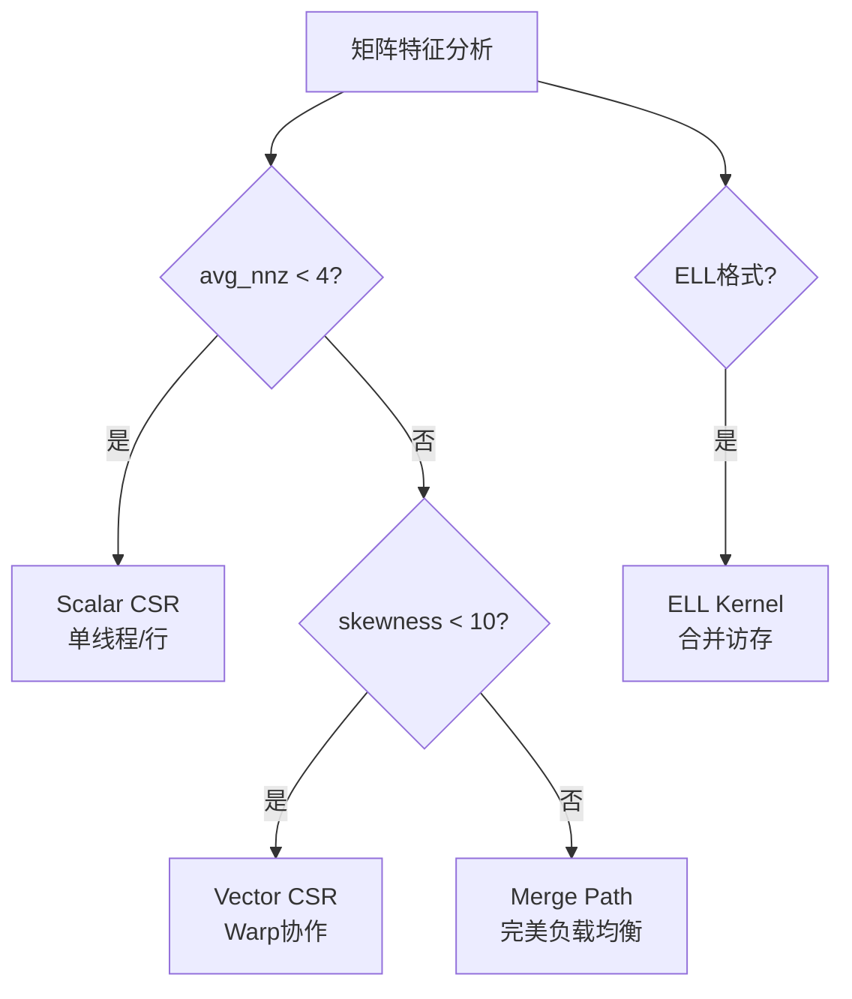

# GPU SpMV 文档
{: .fs-9 }

基于 CUDA 的高性能稀疏矩阵向量乘法库
{: .fs-6 .fw-300 }

[快速开始](installation){: .btn .btn-primary .fs-5 .mb-4 .mb-md-0 .mr-2 }
[查看示例](examples){: .btn .btn-green .fs-5 .mb-4 .mb-md-0 .mr-2 }
[GitHub](https://github.com/LessUp/gpu-spmv){: .btn .fs-5 .mb-4 .mb-md-0 }

---

## ✨ 核心特性

### 多格式支持

| 格式 | 描述 | GPU 效率 |
|:-----|:-----|:--------:|
| **CSR** | Compressed Sparse Row - 通用格式 | ★★★☆☆ |
| **ELL** | ELLPACK - 行长度均匀矩阵 | ★★★★★ |

### 智能 Kernel 选择



### 生产级质量

- 🎯 **RAII 资源管理** — `CudaBuffer`，自动生命周期
- 🔍 **语义化错误码** — `SpMVError`，清晰错误追踪
- 🖥️ **跨平台支持** — Windows / Linux
- 🔧 **CMake Presets** — 一键构建
- ✅ **完整测试覆盖** — Google Test

---

## 🚀 快速开始

### 系统要求

- CUDA Toolkit 11.0+ / 12.0+
- CMake 3.18+
- C++17 编译器
- NVIDIA GPU (CC 7.0+)

### 安装

```bash
git clone https://github.com/LessUp/gpu-spmv.git
cd gpu-spmv
cmake --preset release
cmake --build --preset release
```

### 30 秒示例

```cpp
#include <spmv/spmv.h>

CSRMatrix* csr = csr_create(0, 0, 0);
csr_from_dense(csr, data, 3, 3);
csr_to_gpu(csr);

SpMVConfig config = spmv_auto_config(csr);
SpMVResult result = spmv_csr(csr, d_x, d_y, &config, n);
```

---

## 📚 文档导航

| 文档 | 描述 |
|:-----|:-----|
| [📦 安装指南](installation) | 系统要求、依赖安装、构建步骤 |
| [🏗️ 架构设计](architecture) | 系统架构、核心算法、设计决策 |
| [📚 API 参考](api) | 完整接口文档、数据结构、错误处理 |
| [📝 示例代码](examples) | 基础用法、高级特性、完整应用 |
| [🚀 性能优化](performance) | 调优策略、基准测试、最佳实践 |
| [📋 更新日志](changelog) | 版本历史、迁移指南 |

---

## 📊 性能表现

| 矩阵规模 | 非零元素 | Kernel | 带宽利用率 |
|:--------:|:--------:|:-------|:----------:|
| 10K × 10K | 500K | Vector CSR | ~70% |
| 100K × 100K | 5M | Merge Path | ~65% |
| 1M × 1M | 50M | Merge Path | ~60% |

---

<div class="text-center text-small text-grey-dk-300" style="margin-top: 3rem;">
  <p>GPU SpMV 使用 <a href="https://github.com/LessUp/gpu-spmv/blob/main/LICENSE">MIT License</a> 开源许可</p>
  <p>Copyright &copy; 2024-2025 LessUp</p>
</div>
