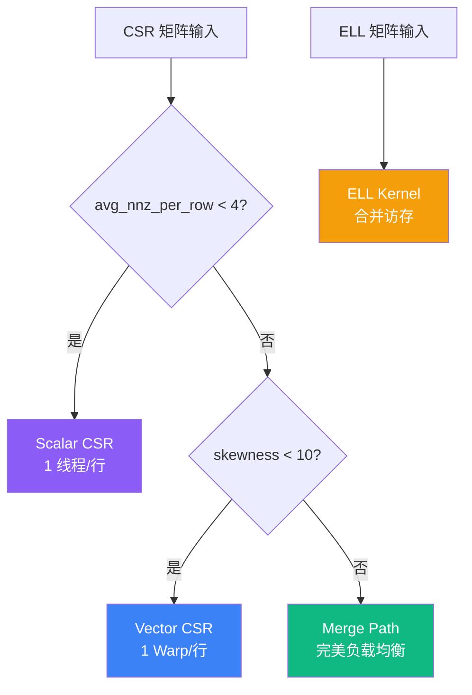

# Kernel 选择策略

基于矩阵特征自动选择最优 Kernel。

## 选择流程



## Kernel 对比

| Kernel | 线程策略 | 最佳场景 | 带宽效率 | 复杂度 |
|:-------|:---------|:---------|:--------:|:------:|
| Scalar CSR | 1 线程/行 | 极稀疏 (nnz/row < 4) | ~40-50% | ★☆☆☆☆ |
| Vector CSR | 1 Warp/行 | 均匀分布 | ~65-75% | ★★☆☆☆ |
| Merge Path | 动态分块 | 高度倾斜 | ~70-80% | ★★★★★ |
| ELL Kernel | 列并行 | 行长度均匀 | ~80-90% | ★★★☆☆ |

## 选择阈值

| 阈值 | 默认值 | 用途 |
|:-----|:------:|:-----|
| `avg_nnz_threshold` | 4.0 | 判断是否使用 Scalar CSR |
| `skewness_threshold` | 10.0 | 判断是否使用 Merge Path |
| `texture_cols_threshold` | 10000 | 启用纹理缓存的向量长度阈值 |

### 自定义阈值

```cpp
SpMVThresholds thresholds = {
    .avg_nnz_threshold = 4.0f,
    .skewness_threshold = 10.0f,
    .texture_cols_threshold = 10000
};
spmv_set_thresholds(thresholds);
```

## 矩阵统计量

### avg_nnz_per_row

每行平均非零元素数。低值表示极稀疏矩阵，适合 Scalar CSR。

### 倾斜度 (Skewness)

每行最大与最小非零元素数的比值：`max / (min + 1)`

- **< 10**：均匀分布 → Vector CSR
- **≥ 10**：倾斜分布 → Merge Path

```cpp
CSRStats stats = csr_compute_stats(csr);
printf("倾斜度: %.2f\n", stats.skewness);
```

## 性能建议

1. **极稀疏矩阵**（avg_nnz < 4）：让 Scalar CSR 处理
2. **均匀矩阵**：Vector CSR 提供良好平衡
3. **倾斜矩阵**：Merge Path 确保负载均衡
4. **行长度均匀**：转换为 ELL 获得最佳性能

## 手动指定

你可以覆盖自动选择：

```cpp
// 强制使用指定 Kernel
SpMVConfig config;
config.kernel_type = KernelType::MERGE_PATH;
config.block_size = 256;
config.use_texture = true;

SpMVResult result = spmv_csr(csr, d_x, d_y, &config);
```

## 参考

- [Bell & Garland (2009)](/zh/references) — CSR vs ELL 分析
- [Merrill & Garland (2016)](/zh/references) — Merge Path 算法
