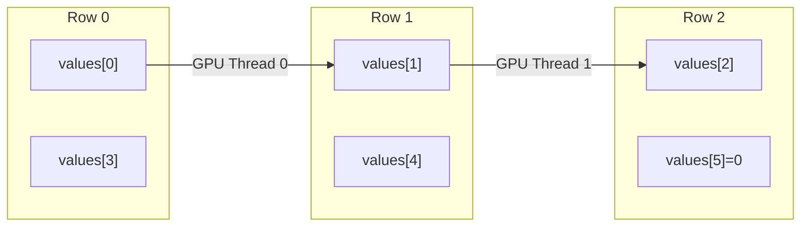

# 内存布局

CSR 和 ELL 稀疏矩阵格式的内存布局详解。

## CSR (Compressed Sparse Row)

### 存储结构

```
原始矩阵:           CSR 存储:
┌─────┬─────┐       values:     [ 1, 2, 3, 4, 5 ]
│ 1 0 2 │       col_indices: [ 0, 2, 1, 2, 3 ]
│ 0 3 4 │   =>  row_ptrs:    [ 0, 2, 4, 5 ]
│ 0 0 5 │       
└─────┴─────┘       row_ptrs[i] 表示第 i 行的起始位置
```

**存储开销**: `O(nnz + num_rows)`

### 数组说明

| 数组 | 大小 | 说明 |
|:-----|:-----|:-----|
| `values` | nnz | 非零元素值，行优先排列 |
| `col_indices` | nnz | 每个非零元素的列索引 |
| `row_ptrs` | num_rows + 1 | 每行的起始偏移量 |

### 访问模式

```
第 i 行的非零元素:
  values[row_ptrs[i]] ... values[row_ptrs[i+1] - 1]
  col_indices[row_ptrs[i]] ... col_indices[row_ptrs[i+1] - 1]
```

### 特点

- 通用格式，存储高效
- 适合不规则稀疏模式
- 行遍历效率高
- GPU 上可能产生非合并访存

## ELL (ELLPACK)

### 存储结构

```
原始矩阵:           ELL 存储（列优先）:
┌─────┬─────┐       values:     [ 1, 3, 5,   ← 第 0 列
│ 1 0 2 │                     2, 4, 0 ]  ← 第 1 列
│ 0 3 4 │   =>  col_indices: [ 0, 1, 3,   ← 第 0 列
│ 0 0 5 │                     2, 2, - ]  ← 第 1 列 (-1 = padding)
└─────┴─────┘       
                    每行补齐到最大长度，-1 表示填充
```

**存储开销**: `O(num_rows × max_nnz_per_row)`

### 数组说明

| 数组 | 大小 | 说明 |
|:-----|:-----|:-----|
| `values` | num_rows × max_nnz_per_row | 列优先存储的非零值 |
| `col_indices` | num_rows × max_nnz_per_row | 列优先的列索引，-1 表示填充 |

### 列优先存储



### 特点

- **列优先存储**: GPU 线程访问连续内存，完全合并
- **无行指针**: 减少一次内存访问
- **对齐填充**: 适合 SIMD 执行
- **缺点**: 行长度差异大时浪费存储

## CSR vs ELL 选择

| 特征 | CSR | ELL |
|:-----|:----|:----|
| 存储效率 | 高（仅存非零元素） | 低（需填充） |
| GPU 访存 | 可能非合并 | 完全合并 |
| 适用场景 | 不规则稀疏 | 行长度均匀 |
| 转换开销 | — | O(nnz) |

### 自动转换

```cpp
// 从 CSR 转换为 ELL
ELLMatrix* ell = ell_create(csr->num_rows, csr->num_cols, max_nnz);
ell_from_csr(ell, csr);

// 判断是否值得转换
CSRStats stats = csr_compute_stats(csr);
bool should_convert = (stats.skewness < 3.0f);
```

## 参考

- [架构概览](/zh/architecture/overview)
- [Kernel 选择策略](/zh/architecture/kernel-selection)
