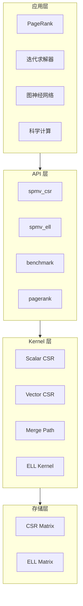

# 架构概览

GPU SpMV 的架构重点不是“模块图长什么样”，而是 **如何把矩阵统计、kernel 选择、执行上下文和验证链路串成可解释的工程系统**。

## 系统架构

## 设计原则

| 原则 | 实现方式 | 好处 |
|:-----|:---------|:-----|
| 分层架构 | 存储、计算、应用分离 | 关注点分离，易于维护 |
| 策略模式 | Kernel 选择可插拔 | 灵活扩展新算法 |
| RAII 管理 | CudaBuffer 自动释放 | 防止内存泄漏 |
| 错误语义化 | SpMVError 枚举 | 清晰诊断信息 |

## 四层架构

### 存储层

定义稀疏矩阵的内存布局：

- **CSR Matrix** — 通用格式，存储高效
- **ELL Matrix** — 列优先存储，GPU 优化

### Kernel 层

实现四种优化的 SpMV 内核：

| Kernel | 线程策略 | 最佳场景 | 带宽效率 |
|:-------|:---------|:---------|:--------:|
| Scalar CSR | 1 线程/行 | 极稀疏 (nnz/row < 4) | ~40-50% |
| Vector CSR | 1 Warp/行 | 均匀分布 | ~65-75% |
| Merge Path | 动态分块 | 高度倾斜 | ~70-80% |
| ELL Kernel | 列并行 | 行长度均匀 | ~80-90% |

### API 层

提供用户友好的接口：

- `spmv_csr()` — CSR 格式 SpMV
- `spmv_ell()` — ELL 格式 SpMV
- `spmv_auto_config()` — 自动选择最优 Kernel
- `pagerank()` — PageRank 算法

### 应用层

构建在 SpMV 之上的应用：

- **PageRank** — 网页排名算法
- **迭代求解器** — CG、GMRES 等
- **图神经网络** — 稀疏图卷积
- **科学计算** — 有限元、CFD

## 这份架构总览最重要的三件事

1. **数据怎么流动**：输入矩阵先被分析，再决定走哪条执行路径。
2. **为什么自动选择成立**：不是玄学 heuristics，而是围绕 `avg_nnz_per_row` 与偏斜度展开。
3. **为什么它可信**：资源管理、错误语义、CPU 参考路径和 property tests 共同形成约束。

## 相关文档

- [Kernel 选择策略](/zh/architecture/kernel-selection)
- [执行流水线](/zh/architecture/execution-pipeline)
- [内存布局](/zh/architecture/memory-layout)
- [可靠性约束](/zh/architecture/reliability)
- [Spec-Driven 开发](/zh/architecture/spec-driven)
