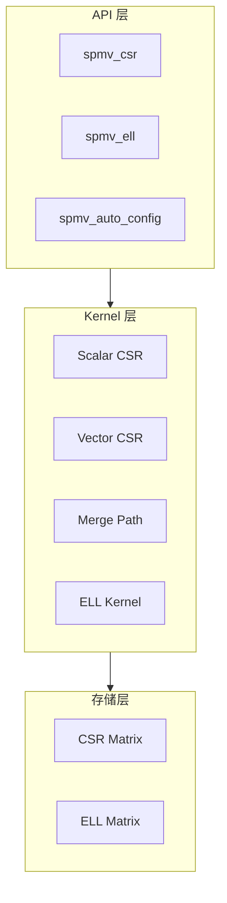

# 架构概览

GPU SpMV 现在把架构刻意收缩到最小闭环：稀疏存储、Kernel 执行、窄而稳定的公开 API。

## 系统架构

## 设计原则

| 原则 | 实现方式 | 好处 |
|:-----|:---------|:-----|
| 分层架构 | 存储与计算分离 | 更易维护 |
| 策略选择 | 基于矩阵统计量选择 Kernel | 执行路径可预测 |
| RAII 管理 | `CudaBuffer<T>` 与执行上下文 | 资源生命周期更安全 |
| 错误语义化 | `SpMVError` 与显式返回值 | 诊断更清晰 |

## 核心层次

### 存储层

- **CSR Matrix** — 通用稀疏格式
- **ELL Matrix** — 面向规则稀疏分布的列主序布局

### Kernel 层

| Kernel | 线程策略 | 最佳场景 | 带宽效率 |
|:-------|:---------|:---------|:--------:|
| Scalar CSR | 1 线程/行 | 极稀疏 (nnz/row < 4) | ~40-50% |
| Vector CSR | 1 Warp/行 | 均匀分布 | ~65-75% |
| Merge Path | 动态分块 | 高度倾斜 | ~70-80% |
| ELL Kernel | 列并行 | 行长度均匀 | ~80-90% |

### API 层

- `spmv_csr()` — CSR 格式执行
- `spmv_ell()` — ELL 格式执行
- `spmv_auto_config()` — 自动选择 Kernel

## 这份架构总览最重要的三件事

1. **数据如何流动**：从稀疏存储到选定 Kernel，再到校验后的输出。
2. **为什么自动选择成立**：围绕 `avg_nnz_per_row` 与偏斜度，而不是不透明调参。
3. **为什么它可信**：RAII、显式错误和聚焦测试共同提供约束。

## 相关文档

- [Kernel 选择策略](/zh/architecture/kernel-selection)
- [执行流水线](/zh/architecture/execution-pipeline)
- [内存布局](/zh/architecture/memory-layout)
- [可靠性约束](/zh/architecture/reliability)
