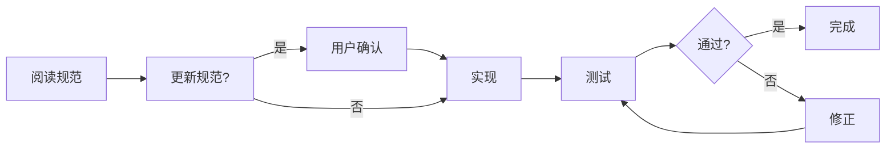

# Spec-Driven Development

GPU SpMV 采用 **OpenSpec** 规范驱动开发模式，所有功能先定义规范，再实现代码。

## 什么是 OpenSpec？

OpenSpec 是一种结构化规范系统，将规范作为单一真理来源：

```
openspec/
├── specs/           # 功能规范 (单一真理来源)
│   ├── csr-format/
│   │   ├── spec.md      # 接口契约
│   │   └── design.md    # 设计决策
│   ├── ell-format/
│   ├── spmv-kernels/
│   ├── public-api/
│   └── ...
└── changes/         # 变更提案
    ├── active/      # 进行中的变更
    └── archive/     # 已完成的变更
```

## 规范示例

### CSR 格式规范 (摘录)

```yaml
# openspec/specs/csr-format/spec.md

功能: CSR 稀疏矩阵格式
状态: STABLE

接口:
  - csr_create(num_rows, num_cols, nnz) -> CSRMatrix*
  - csr_destroy(mat)
  - csr_to_gpu(mat) -> int
  - csr_from_gpu(mat) -> int

不变量:
  - mat->nnz == mat->row_ptrs[mat->num_rows]
  - mat->row_ptrs[i] <= mat->row_ptrs[i+1]
  - all indices in col_indices are valid

测试要求:
  - 必须验证内存泄漏
  - 必须验证边界条件
  - Property tests: >= 100 iterations
```

## 变更追溯

每个功能变更都有完整的提案记录：

| 变更 | 日期 | 影响 | 状态 |
|:-----|:-----|:-----|:----:|
| CSR 格式基础实现 | 2025-01-15 | 核心数据结构 | ✅ |
| ELL 格式支持 | 2025-02-10 | 多格式 | ✅ |
| SpMV 内核优化 | 2025-02-20 | 性能提升 | ✅ |
| Kernel 自动选择 | 2025-03-01 | 易用性 | ✅ |
| 基准测试框架 | 2025-03-05 | 可验证性 | ✅ |
| PageRank 应用 | 2025-03-10 | 应用层 | ✅ |
| 项目完成 | 2026-04-01 | 整体质量 | ✅ |

## 为什么使用 Spec-Driven？

### 1. 可追溯性

每个设计决策都有文档记录：

```markdown
# openspec/specs/spmv-kernels/design.md

## 决策: 为什么选择 Merge Path？

**背景**: 高度倾斜的矩阵导致 Vector CSR 负载不均

**选项**:
1. CSR5 格式 - 实现复杂
2. Merge Path - 完美负载均衡
3. 动态调度 - 同步开销大

**选择**: Merge Path

**理由**:
- 完美负载均衡
- 实现 Mercury 可用
- 性能稳定可预测
```

### 2. 可验证性

规范即测试契约：

```cpp
// 测试直接验证规范不变量
TEST(CSRMatrix, Invariants) {
    CSRMatrix* mat = create_random_csr();

    // 不变量 1: nnz == row_ptrs[num_rows]
    EXPECT_EQ(mat->nnz, mat->row_ptrs[mat->num_rows]);

    // 不变量 2: row_ptrs 单调递增
    for (int i = 0; i < mat->num_rows; i++) {
        EXPECT_LE(mat->row_ptrs[i], mat->row_ptrs[i+1]);
    }

    // 不变量 3: 列索引有效
    for (int i = 0; i < mat->nnz; i++) {
        EXPECT_GE(mat->col_indices[i], 0);
        EXPECT_LT(mat->col_indices[i], mat->num_cols);
    }
}
```

### 3. 可维护性

新贡献者快速理解设计：

1. 阅读 `spec.md` 了解接口
2. 阅读 `design.md` 理解决策
3. 查看 `changes/archive/` 了解历史

### 4. 一致性

规范驱动，避免实现偏差：

```
规范定义 → 测试验证 → 实现代码
    ↑                         ↓
    └─────── 不匹配时反馈 ←────┘
```

## 工作流程



## 面试加分点

在面试中展示 Spec-Driven Development：

1. **专业方法论**: 展示你了解软件工程最佳实践
2. **文档能力**: 规范文档展示技术写作能力
3. **质量意识**: 测试驱动、可验证性
4. **维护思维**: 考虑长期维护和协作

## 参考

- [OpenSpec 规范](https://github.com/LessUp/gpu-spmv/tree/main/openspec)
- [架构概览](/zh/architecture/overview)