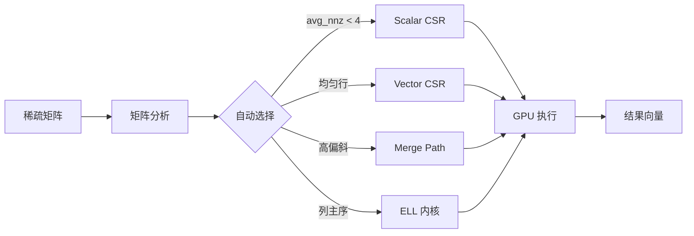

  

    
GPU

    

      GPU SpMV
      技术白皮书
    

  

  

    <a href="./whitepaper/">白皮书</a>
    <a href="https://github.com/LessUp/gpu-spmv">GitHub</a>
    <a href="../en/">English</a>
  

  <h1>生产级 CUDA 稀疏矩阵向量乘法</h1>
  

    高性能稀疏矩阵向量乘法（SpMV），在现代 NVIDIA GPU 上实现 <strong>70%+ 理论内存带宽利用率</strong>。
    4 个自适应内核、智能选择算法、完整 API。
  

  

    <a href="./whitepaper/" class="primary">阅读白皮书</a>
    <a href="./quickstart" class="secondary">快速开始</a>
  

  

    
70%+

    
带宽利用率

  

  

    
4

    
自适应内核

  

  

    
CSR+ELL

    
稀疏格式

  

  

    
100+

    
测试用例

  

## 架构概览

## 技术特性

  

    
内核选择策略

    

      基于矩阵特征自动选择最优内核：平均非零元数、行长度偏斜度。
    

    

      <a href="./architecture/kernel-selection" class="feature-tag">详细说明</a>
    

  

  

    
Merge Path 算法

    

      针对不规则稀疏模式的完美负载均衡，O(nnz + m) 工作分解。
    

    

      <a href="./whitepaper/philosophy" class="feature-tag">设计哲学</a>
    

  

  

    
生产级质量

    

      RAII 资源管理、语义化错误码、CudaBuffer 抽象、跨平台支持。
    

    

      <a href="./api/spmv" class="feature-tag">API</a>
    

  

  

    
Spec-Driven 开发

    

      OpenSpec 规范驱动工作流，设计决策可追溯，文档即代码。
    

    

      <a href="./architecture/spec-driven" class="feature-tag">工作流</a>
    

  

  

    
学术严谨

    

      完整的学术引用支持、BibTeX 格式、相关论文参考。
    

    

      <a href="./citation" class="feature-tag">引用格式</a>
    

  

  

    
快速开始

    

      <code>git clone https://github.com/LessUp/gpu-spmv.git</code>
    

    

      <a href="./quickstart" class="feature-tag">详细指南</a>
    

  

