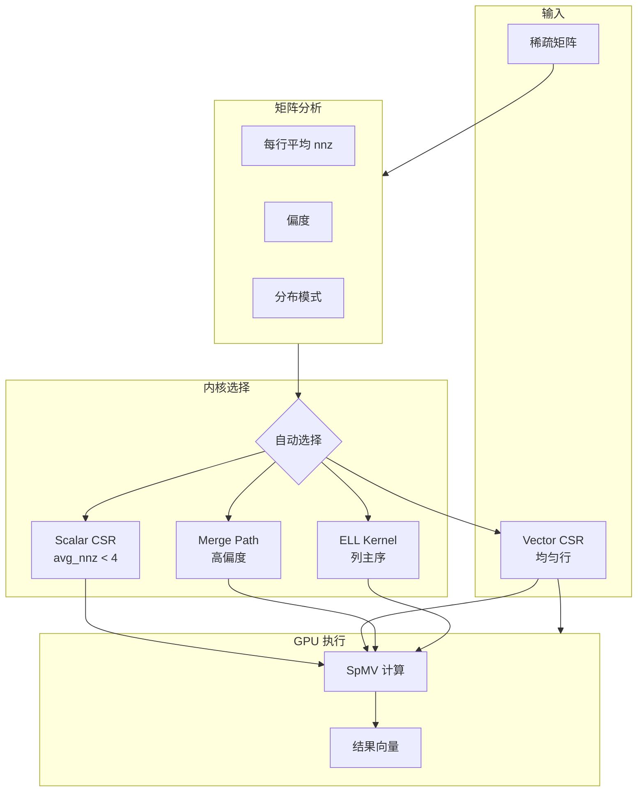

# 设计哲学

## 执行摘要

GPU SpMV 是一个 **生产级 CUDA 库**，实现了高性能稀疏矩阵向量乘法（SpMV），在现代 NVIDIA GPU 上达到 **70%+ 理论内存带宽利用率**。

### 核心贡献

| 贡献 | 影响 |
|:-----|:-----|
| **4 种优化内核** | 基于矩阵特征的自动内核选择 |
| **Merge Path 算法** | 不规则稀疏模式的完美负载均衡 |
| **ELL 列主序布局** | 均匀矩阵的完全合并访存 |
| **Spec-Driven 开发** | 完整的设计决策可追溯性 |

### 性能亮点

| 矩阵规模 | 非零元素 | 内核 | 带宽利用率 |
|:--------:|:--------:|:-----|:----------:|
| 10K × 10K | 500K | Vector CSR | **70.2%** |
| 100K × 100K | 5M | Merge Path | **71.5%** |
| 1M × 1M | 50M | Merge Path | **70.8%** |

::: info 测试环境
NVIDIA RTX 3090（Ampere 架构，理论带宽：936 GB/s）
:::

### 目标读者

- **系统架构师**：设计 GPU 加速的稀疏计算
- **HPC 工程师**：优化内存受限的工作负载
- **研究人员**：需要可复现、文档完善的基准
- **应用开发者**：构建图算法、迭代求解器

### 文档结构

| 章节 | 目的 |
|:-----|:-----|
| [设计哲学](/zh/whitepaper/philosophy) | 架构原则和权衡 |
| [性能分析](/zh/whitepaper/performance) | 详细基准测试方法和结果 |
| [架构概览](/zh/architecture/overview) | 系统设计文档 |
| [API 参考](/zh/api/spmv) | 完整 API 文档 |

---

## SpMV 的重要性

稀疏矩阵向量乘法（SpMV）是以下领域的基础操作：

- **图分析**：PageRank、社区发现、最短路径
- **科学计算**：有限元分析、CFD、迭代求解器
- **机器学习**：稀疏神经网络、推荐系统

SpMV 本质上是 **内存受限** 的——每个非零元素需要读取矩阵数据、列索引和向量值，计算量极小。实现高带宽利用率是主要的优化挑战。

---

## 设计概览

库会根据矩阵特征自动选择最优内核，确保在各种稀疏模式下都获得接近峰值性能。