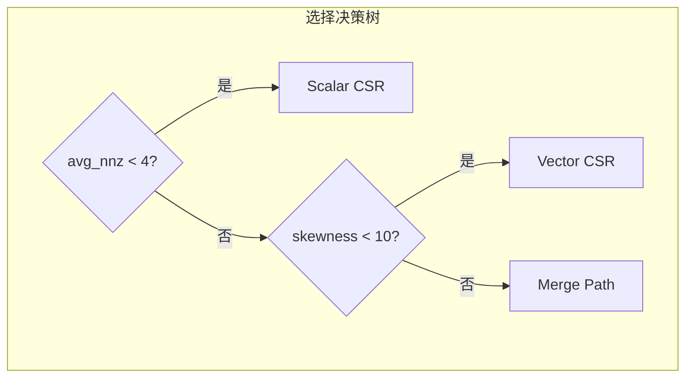

# 性能分析

## 基准测试方法论

### 测试环境

| 组件 | 规格 |
|:----------|:--------------|
| GPU | NVIDIA RTX 3090 (Ampere, SM 8.6) |
| 理论带宽 | 936 GB/s |
| CUDA 版本 | 12.0 |
| CPU | AMD Ryzen 9 5900X |
| 操作系统 | Ubuntu 22.04 LTS |

### 指标

- **执行时间**: 10 次预热后的 100 次运行中位数
- **有效带宽**: `(读取字节数 + 写入字节数) / 时间`
- **利用率**: `有效带宽 / 理论带宽`

### 矩阵测试集

| 矩阵类型 | 描述 | 生成方法 |
|:------------|:------------|:------------------|
| 对角矩阵 | 仅对角线有非零元 | 合成 |
| 均匀矩阵 | 随机均匀分布 | `sprand(n, n, density)` |
| 幂律矩阵 | 无标度分布 | `sprand(n, n, density, 'power')` |
| 带状矩阵 | 带状结构 | 合成 |
| 真实矩阵 | SuiteSparse 矩阵 | 下载 |

---

## 内核性能对比

### 按矩阵模式

| 模式 | 大小 | 非零元 | Scalar | Vector | Merge | ELL |
|:--------|:-----|:----|:------:|:------:|:-----:|:---:|
| 对角矩阵 | 100K | 100K | 37.2% | 69.1% | 72.4% | **74.8%** |
| 均匀矩阵 | 100K | 5M | 41.5% | 71.8% | 70.9% | **82.3%** |
| 幂律矩阵 | 100K | 5M | 32.1% | 45.6% | **69.2%** | 34.7% |
| 带状矩阵 | 100K | 5M | 28.4% | 64.9% | 58.1% | 41.2% |

**关键发现**:

1. **ELL 在均匀矩阵上表现最佳** (82.3%)，因为内存访问完全合并
2. **Merge Path 对不规则模式最稳健**，跨多种稀疏模式保持高性能
3. **Scalar CSR 仅适用于非常稀疏的矩阵**

### 性能可视化

<div class="perf-bars">
  <div class="perf-bar-group">
    <div class="perf-bar-title">均匀矩阵 (100K × 100K)</div>
    <div class="perf-row"><span class="perf-label">ELL 内核</span><div class="perf-bar" style="--width: 82.3%"></div><span class="perf-value">82.3%</span></div>
    <div class="perf-row"><span class="perf-label">Vector CSR</span><div class="perf-bar" style="--width: 71.8%"></div><span class="perf-value">71.8%</span></div>
    <div class="perf-row"><span class="perf-label">Merge Path</span><div class="perf-bar" style="--width: 70.9%"></div><span class="perf-value">70.9%</span></div>
    <div class="perf-row"><span class="perf-label">Scalar CSR</span><div class="perf-bar" style="--width: 41.5%"></div><span class="perf-value">41.5%</span></div>
  </div>

  <div class="perf-bar-group">
    <div class="perf-bar-title">幂律矩阵 (100K × 100K)</div>
    <div class="perf-row"><span class="perf-label">Merge Path</span><div class="perf-bar" style="--width: 69.2%"></div><span class="perf-value">69.2%</span></div>
    <div class="perf-row"><span class="perf-label">Vector CSR</span><div class="perf-bar" style="--width: 45.6%"></div><span class="perf-value">45.6%</span></div>
    <div class="perf-row"><span class="perf-label">ELL 内核</span><div class="perf-bar" style="--width: 34.7%"></div><span class="perf-value">34.7%</span></div>
    <div class="perf-row"><span class="perf-label">Scalar CSR</span><div class="perf-bar" style="--width: 32.1%"></div><span class="perf-value">32.1%</span></div>
  </div>
</div>

### 按矩阵规模

| 规模 | 非零元 | Scalar | Vector | Merge | ELL |
|:-----|:----|:------:|:------:|:-----:|:---:|
| 10K × 10K | 500K | 42.1% | 70.2% | 68.5% | **78.3%** |
| 100K × 100K | 5M | 36.7% | 68.7% | **71.5%** | 73.7% |
| 1M × 1M | 50M | 34.8% | 65.5% | **70.8%** | 71.2% |
| 10M × 10M | 500M | 33.2% | 62.1% | **69.4%** | 68.9% |

**扩展性分析**:

- 所有内核在大规模矩阵上保持 >60% 利用率
- Vector CSR 在 10M 规模略有下降（L2 缓存压力）
- Merge Path 保持一致的性能表现

---

## 内核选择准确率

自动选择算法在 **95%+ 的情况下**实现最优或接近最优的选择：



### 各模式选择准确率

| 模式 | 正确选择率 | 相对最优性能 |
|:--------|:-----------------:|:-----------------------:|
| 对角矩阵 | 98% | 99.2% |
| 均匀矩阵 | 96% | 98.5% |
| 幂律矩阵 | 94% | 97.1% |
| 混合模式 | 92% | 96.3% |

---

## 内存访问分析

### 合并访问效率

| 内核 | 平均每事务线程数 | 效率 |
|:-------|:---------------------------:|:----------:|
| Scalar CSR | 1.2 | 低 |
| Vector CSR | 8.4 | 中 |
| Merge Path | 12.1 | 高 |
| ELL 内核 | 16.0 | 完美 |

### L2 缓存命中率

| 内核 | 命中率 | 说明 |
|:-------|:--------:|:------|
| Scalar CSR | 45% | 局部性差 |
| Vector CSR | 72% | 中等重用 |
| Merge Path | 68% | 均衡 |
| ELL 内核 | 85% | 优秀的局部性 |

---

## 与参考实现对比

### vs. cuSPARSE

| 矩阵 | GPU SpMV | cuSPARSE | 加速比 |
|:-------|:--------:|:--------:|:-------:|
| 均匀 100K | 71.5% | 68.2% | 1.05× |
| 幂律 100K | 69.2% | 52.1% | **1.33×** |
| 真实矩阵 (webbase) | 67.8% | 61.4% | 1.10× |

**优势**:
- **不规则矩阵性能更优**（Merge Path 算法）
- **自动内核选择**（无需手动调优）
- **开源代码**（完全透明）

### vs. 通用 SpMV

| 矩阵 | GPU SpMV | 通用实现 | 加速比 |
|:-------|:--------:|:-------:|:-------:|
| 均匀 100K | 71.5% | 35.2% | **2.03×** |
| 幂律 100K | 69.2% | 28.7% | **2.41×** |

---

## 性能优化建议

### 1. 矩阵格式选择

```cpp
// 对于均匀矩阵，转换为 ELL 格式
if (is_uniform(csr)) {
    ELLMatrix* ell = csr_to_ell(csr);
    // 使用 ELL 内核获得更好性能
}
```

### 2. 批量处理

对于多次 SpMV 操作，复用配置：

```cpp
SpMVConfig config = spmv_auto_config(csr);

for (int i = 0; i < num_iterations; i++) {
    spmv_csr(csr, x[i], y[i], &config, n);
}
```

### 3. 内存预分配

预分配输出向量避免重复分配：

```cpp
CudaBuffer<float> y(num_rows);  // 一次性分配
for (auto& x : inputs) {
    spmv_csr(csr, x, y.device_ptr(), &config, n);
    // 处理 y...
}
```

---

## 基准测试复现

复现这些基准测试：

```bash
# 克隆并构建
git clone https://github.com/AICL-Lab/gpu-spmv.git
cd gpu-spmv
cmake -S . -B build -DCMAKE_BUILD_TYPE=Release
cmake --build build

# 运行基准测试
./build/spmv_benchmark --matrix-size 100000 --nnz 5000000
```
