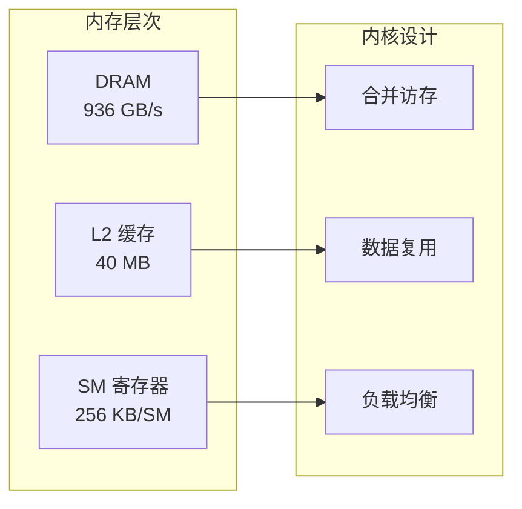
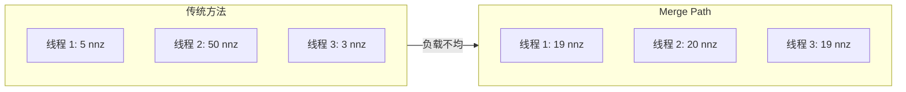

# 设计哲学

## 核心原则

### 1. 内存带宽感知

SpMV 本质上是内存受限的。我们的设计优先考虑：



**关键洞察**：在现代 GPU 上，内存带宽是瓶颈。我们的内核设计旨在最大化内存吞吐量，而非计算吞吐量。

### 2. 自适应计算

没有单一内核对所有矩阵最优。我们的自适应选择基于：

| 矩阵特征 | 最优内核 | 选择条件 |
|:---------|:---------|:---------|
| avg_nnz < 4 | Scalar CSR | 每行并行度低 |
| 均匀分布 | Vector CSR | 一致的 warp 利用率 |
| 高偏度 | Merge Path | 完美工作分区 |
| ELL 可转换 | ELL Kernel | 合并内存访问 |

**选择算法**：

```cpp
SpMVKernel select_kernel(const CSRMatrix* csr) {
    double avg_nnz = (double)csr->nnz / csr->num_rows;
    
    if (avg_nnz < 4.0) {
        return KERNEL_SCALAR_CSR;  // 低并行度
    }
    
    double skewness = compute_skewness(csr);
    
    if (skewness < 10.0) {
        return KERNEL_VECTOR_CSR;  // 均匀行
    }
    
    return KERNEL_MERGE_PATH;      // 不规则模式
}
```

### 3. 极简治理

项目现在优先控制维护面：

- 对外 API 只保留核心 SpMV 能力。
- 把验证放进测试和示例，而不是并行维护一套流程框架。
- 不再把展示型模块直接塞进库本体。

---

## 内核设计权衡

### Scalar CSR vs Vector CSR

| 方面 | Scalar CSR | Vector CSR |
|:-----|:-----------|:-----------|
| 并行度 | 每行一线程 | 每行一 warp |
| 内存访问 | 非合并 | 部分合并 |
| 适用场景 | 极稀疏矩阵 | 均匀稀疏 |
| 开销 | 低 | 中 |

### Merge Path 算法

Merge Path 算法为不规则矩阵提供 **完美负载均衡**：



### ELL 格式

对于行长度均匀的矩阵，ELL 格式实现 **完全合并访存**：

```
列主序布局：
values[k * num_rows + i] = A[i][col[k]]

访存模式：
线程 i 读取 values[0..num_cols-1] * num_rows + i
→ 连续线程访问连续内存
```

---

## 错误处理哲学

我们使用 **语义化错误码** 而非异常：

```cpp
typedef enum {
    SPMV_SUCCESS = 0,
    SPMV_ERROR_NULL_POINTER,
    SPMV_ERROR_INVALID_DIMENSIONS,
    SPMV_ERROR_CUDA_MALLOC,
    SPMV_ERROR_CUDA_MEMCPY,
    // ...
} SpMVError;
```

优势：
- **性能**：无异常开销
- **互操作性**：C 兼容 API
- **调试**：显式错误传播

---

## RAII 资源管理

所有 GPU 资源通过 `CudaBuffer<T>` 管理：

```cpp
template<typename T>
class CudaBuffer {
public:
    CudaBuffer(size_t size);
    ~CudaBuffer();  // 自动 cudaFree
    
    T* device_ptr();
    void copy_from_host(const T* src);
    void copy_to_host(T* dst);
    
private:
    T* d_ptr_;
    size_t size_;
};
```

这确保即使在错误路径也 **无内存泄漏**。